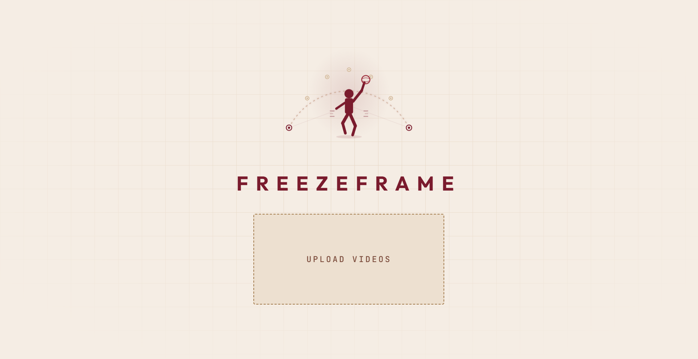
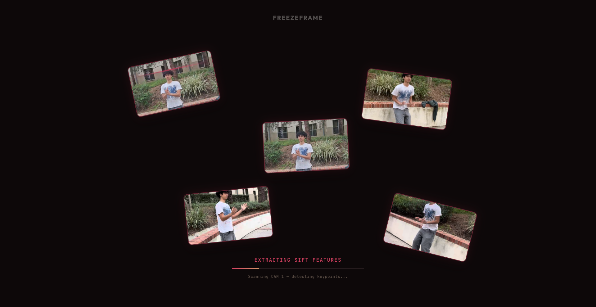
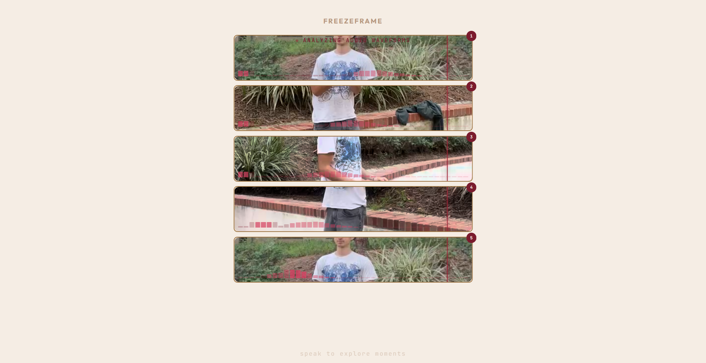
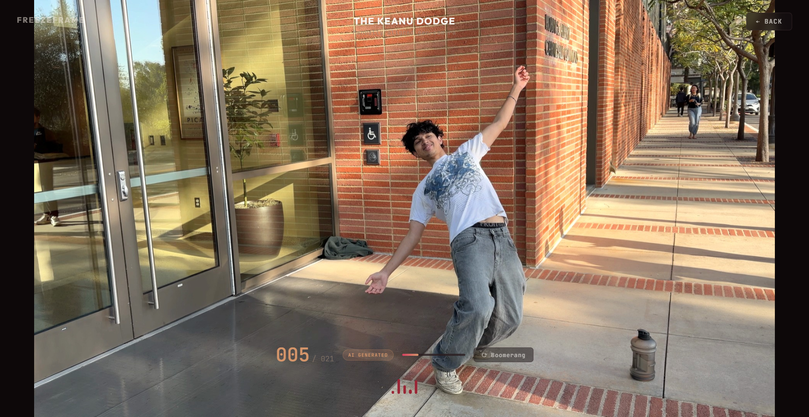
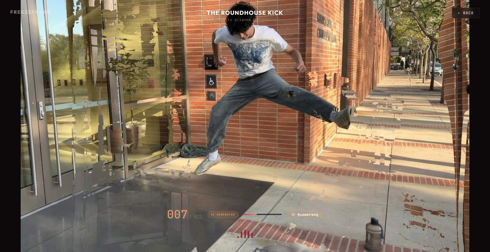
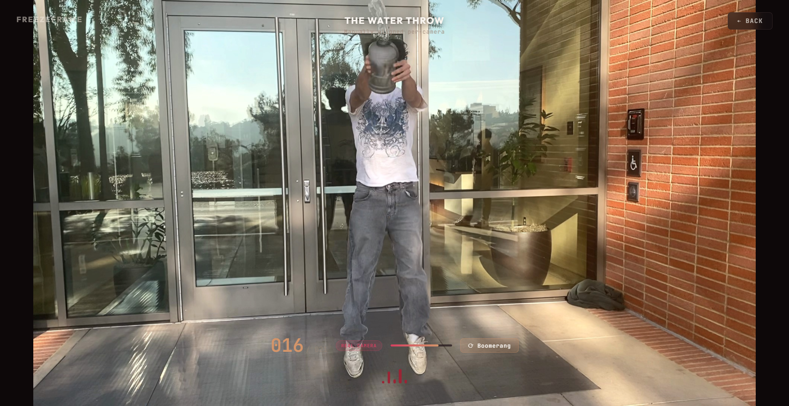
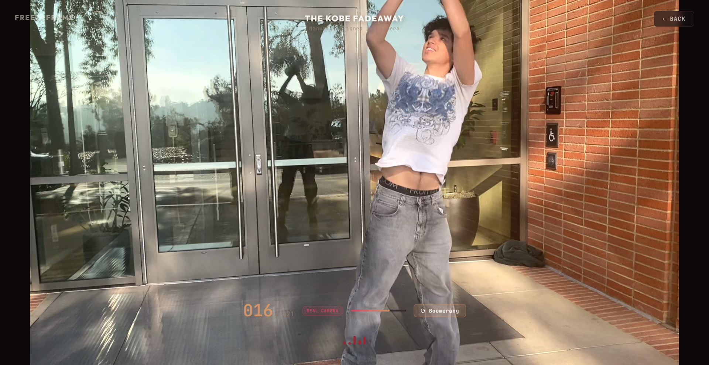

# FreezeFrame

**Bullet-time sports replay from 4 phones. No $500K camera rig required.**

FreezeFrame turns a handful of smartphone videos into a fully navigable, frozen-moment 3D experience — the same "Matrix" bullet-time effect that broadcast networks achieve with 30+ synchronized cameras and six-figure production budgets. We do it with 4 iPhones, a clap to sync, and a pipeline that fills the gaps with AI.

Talk to your replay. Ask it to *"show me the release"* and watch the camera orbit a frozen athlete mid-air while a voice narrates the physics of the moment.

---

<p align="center">
  
</p>

<p align="center">
  
  
</p>

<p align="center">
  
  
</p>
<p align="center">
  
  
</p>

---

## Why This Matters

| Traditional Bullet-Time | Replay |
|---|---|
| 20-50 synchronized cameras | 4 smartphones |
| $200K-$500K+ hardware | $0 hardware (phones you already own) |
| Permanent arena installation | Set up anywhere in 30 seconds |
| Weeks of post-production | Minutes of automated pipeline |
| Silent playback | Voice-controlled, AI-narrated |

**For recruiters and coaches**, this means you can film a pickup game, a practice session, or a combine drill from four angles and get back a broadcast-quality replay you can scrub through from any viewing angle. Query specific moments in natural language: *"show me his release point"*, *"jump to the celebration"*, *"describe the mechanics of that throw"*. FreezeFrame finds it, freezes it, and lets you orbit around the athlete like you're walking around a paused hologram.

No camera crew. No editing suite. No budget.

---

## The Breakthrough: Nano Banana Pro as a Reliable Production Tool

The biggest open problem in generative media is **hallucination**. You can't trust image generation models in production because they invent details — wrong fingers, phantom limbs, shifted backgrounds. Every serious media pipeline avoids generative AI for exactly this reason.

We found the exception.

**The insight**: if you don't ask a generative model to *imagine* a scene from scratch, but instead give it overwhelming context and ask it to *fill a small gap between known viewpoints*, hallucination becomes a solvable problem. The model isn't dreaming — it's interpolating.

**Gemini's image generation (Nano Banana Pro 2)** accepts up to **14 reference images** in a single call. This is the capability that makes our entire project possible:

- We feed it all 4 real camera frames as hard anchors
- We add previously generated synthetic views as additional context
- We describe the exact camera angle we need (e.g., *"12 degrees clockwise from Camera 2"*)
- The model generates a photorealistic intermediate view that respects the geometry

**Why 14 reference frames changes everything:**

| Reference Images | What Happens |
|---|---|
| 0-1 (typical image gen) | Pure hallucination — invents pose, background, lighting |
| 2-3 | Rough interpolation, but drifts on details |
| 4+ (our real cameras) | Geometry is locked — pose, background, lighting all constrained |
| 8-14 (real + synthetic) | Near-perfect interpolation — character permanence, background consistency |

With enough reference frames, the model has so many constraints that there's almost nothing left to hallucinate. The person's pose is identical across all references. The background is visible from multiple angles. The lighting is consistent. The model's job reduces from "imagine a human" to "rotate the camera 8 degrees" — and it does that extremely well.

**This is a new, reliable use case for generative AI in media production.** Not replacing cameras, but filling the gaps between them. Not generating from imagination, but interpolating from evidence.

### Recursive Edge-Inward Generation

We don't just naively generate views. Our gap-filling strategy maximizes reference context at every step:

```
Real cameras:     [C1] -------- [C2] -------- [C3] -------- [C4]

Round 1 (edges):  [C1] -[S1]-- [C2] --[S2]- [C3] -[S3]-- [C4]
                  (S1 sees C1+C2, S2 sees C2+C3, S3 sees C3+C4)

Round 2 (middle): [C1] [S1] [S4] [C2] [S5] [S2] [C3] [S6] [S3] [C4]
                  (S4 sees C1+S1+C2, S5 sees C2+S2+C3, S6 sees C3+S3+C4)
```

Each synthetic frame is generated with maximum context — the real cameras plus the previously generated edges. By the final round, every synthetic view has 8-14 reference images constraining it. The result is a smooth orbit strip with consistent character appearance across every frame.

---

## Architecture

```
                    4 Phone Videos (synced via audio clap)
                                    |
                    +---------------+---------------+
                    |                               |
            [ VGGT Pipeline ]              [ Bullet-Time Pipeline ]
            Camera poses + depth            Moment detection (Gemini 2.5 Flash)
            3D Gaussian Splatting           Frame snapping to sharpest views
            Per-frame .ply files            Gap filling (Nano Banana Pro 2)
                    |                       Depth warping + inpainting
                    |                               |
                    +---------------+---------------+
                                    |
                          [ Interactive Viewer ]
                          Three.js + Spark.js
                          Drag-to-orbit, image strip, splat playback
                                    |
                          [ Gemini Live Voice ]
                          "Show me the release"
                          Real-time narration + viewer control
```

### Pipeline A: 3D Gaussian Splatting via VGGT

For full 3D reconstruction, we use **VGGT** (CVPR 2025 Best Paper) — a vision transformer that processes all camera views in a single forward pass and outputs camera poses, depth maps, and point clouds. This replaces the traditional COLMAP pipeline (hours) with a single inference call (seconds).

The point clouds initialize **4D Gaussian Splatting**, which trains per-frame 3D scenes that the viewer renders in real-time via GPU rasterization.

### Pipeline B: Bullet-Time via Generative Gap Filling

For the signature frozen-orbit effect:

1. **Moment Detection** — Gemini 2.5 Flash watches all 4 videos and identifies key moments (release point, peak of jump, celebration)
2. **Frame Snapping** — Selects the sharpest frame from each camera at the target moment
3. **Gap Filling** — Nano Banana Pro 2 generates synthetic views between every pair of adjacent cameras using the recursive edge-inward strategy
4. **Depth Warping** — Depth Anything V2 estimates depth, forward-warps geometry to create intermediate views
5. **Inpainting** — Imagen 3 repairs disoccluded regions from the depth warp
6. **Assembly** — All real + synthetic frames are stitched into a smooth orbit strip

### Voice Control

The viewer connects to **Gemini Live** via WebSocket for real-time voice interaction:

- *"Show me the release"* — navigates to the detected moment
- *"Describe what's happening"* — narrates the biomechanics of the frozen frame
- *"Play a boomerang"* — loops the orbit back and forth
- *"Zoom in"* — adjusts the camera

The AI has full access to the moment catalog and viewer controls via function calling. It doesn't just describe — it drives the camera.

---

## Quick Start

```bash
# Clone and install
git clone https://github.com/mia373/FreezeFrame.git
cd FreezeFrame

# Install Python deps
pip install -r requirements.txt

# Install viewer deps
cd viewer && npm install && cd ..

# Set your API key
cp .env.example .env
# Edit .env and add your GEMINI_API_KEY (get one at aistudio.google.com)

# Start everything (works on Windows, Mac, Linux)
python start.py
# Viewer: http://localhost:5173
# Voice:  ws://localhost:8765
```

---

## Tech Stack

| Component | Technology |
|---|---|
| 3D Reconstruction | VGGT + 4D Gaussian Splatting |
| View Synthesis | Gemini 3 Pro Image (Nano Banana Pro 2) |
| Moment Detection | Gemini 2.5 Flash |
| Depth Estimation | Depth Anything V2 |
| Inpainting | Imagen 3 (Vertex AI) |
| Voice Control | Gemini Live (`gemini-3.1-flash-live-preview`) |
| Viewer | Three.js + Spark.js + Vite |
| Camera Sync | Audio clap detection (FFT cross-correlation) |

---

## Team

Built at a hackathon by a team that believed $500K camera rigs shouldn't be the barrier to understanding athletic performance.

---

*4 phones. 1 clap. Infinite angles.*
